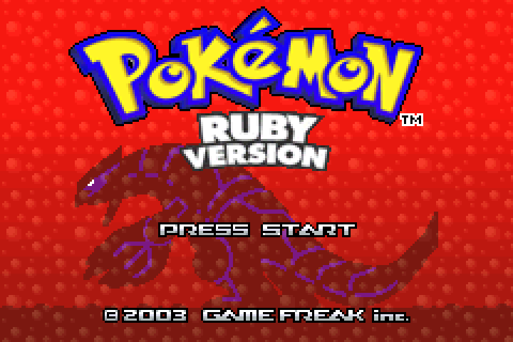

# ngba

Lightweight, high-performance Game Boy Advance emulator written in modern C++ with native execution.



NGBA is a lightweight, standalone Game Boy Advance emulator built from scratch in C++14. It is engineered for performance, precision, and simplicity—featuring an ARM7TDMI core with native machine-code translation fallback, cycle-stepped hardware events, an optimized 2D PPU pipeline, and a responsive Win32 GUI with sub-millisecond frame pacing.

---

## Features

- **Dual-Engine CPU Core**:
  - Accurate ARM7TDMI cycle-stepped interpreter.
  - Native machine-code JIT emitter backend with differential fallback for complex instructions.
  - Direct 16-bit and 32-bit bus memory fast paths for IWRAM, EWRAM, and VRAM.
  - $O(1)$ WAITCNT cycle classification and Game Pak prefetch buffer simulation.

- **High-Performance 2D PPU Pipeline**:
  - Complete support for background modes 0–5 (text, affine, and bitmap).
  - 4bpp and 8bpp sprites (OAM) with 1D/2D mapping, mosaic, affine matrix transforms, and double-size canvases.
  - Windowing, object windows, alpha blending, and brightness effects.
  - Zero heap allocation per-frame render loop with 32-bit packed tile batching and transparent row skipping.

- **Precise Timing & Hardware Emulation**:
  - Master-clock event scheduler for HBlank, VBlank, timers 0–3, and cascade timers.
  - Immediate, HBlank, and VBlank DMA transfers with destination reload modes.
  - Keypad controller (`KEYINPUT`/`KEYCNT`) with interrupt generation.
  - Cartridge backup support for FLASH512 and FLASH1M commands, chip/sector erase, and bank switching.

- **Modern Win32 Frontend**:
  - Single standalone portable executable (`ngba.exe`) with no required external runtime DLLs.
  - Hardware timer-paced main loop (`timeBeginPeriod(1)`) guaranteeing a steady 59.73 Hz guest refresh rate.
  - Real-time framerate and guest frame counter displayed in the title bar.
  - **3x Fast-Forward Pacing**: Hold `Tab` for smooth, uncapped, or locked ~179.1 FPS fast-forward.
  - **12 Save Slots**: Dedicated slots 1–12 with instant save (`Shift+F1`–`F12`) and load (`F1`–`F12`), protected by state hashing and version validation.
  - Unicode path support for ROMs, BIOS files, and save states.

---

## Controls

| Action | Key |
| :--- | :--- |
| **D-Pad** (Up, Down, Left, Right) | `Arrow Keys` |
| **GBA A / B** | `Z` / `X` |
| **GBA L / R** | `A` / `S` |
| **Start / Select** | `Enter` / `Backspace` |
| **Fast-Forward (3x, ~180 FPS)** | Hold `Tab` |
| **Pause / Resume** | `P` or `Space` |
| **Advance Single Frame** | `Ctrl+N` (while paused) |
| **Save State (Slots 1–12)** | `Shift+F1` through `Shift+F12` |
| **Load State (Slots 1–12)** | `F1` through `F12` |

---

## Performance & Optimization

NGBA's core and renderer have been profiled and tuned for low-overhead execution:

| Component | Unoptimized | Optimized | Improvement |
| :--- | :--- | :--- | :--- |
| **CPU Execution** | 27.0 ms / frame | **3.74 ms / frame** | **-86.1%** |
| **PPU Rendering** | 13.35 ms / frame | **2.19 ms / frame** | **-83.6%** |
| **Total Frame Time** | 40.35 ms / frame | **5.93 ms / frame** | **-85.3%** |
| **Peak Throughput** | ~24 FPS | **168+ FPS** (Rendered) | **~7x faster** |

- **Sub-millisecond Pacing**: Smooth dual-tier sleep/yield scheduling eliminates jitter and delivers exact 59.73 Hz nominal display timing.
- **Zero Allocations in Hot Paths**: Member buffer reuse completely eliminates per-frame heap thrashing.
- **Direct Memory Accesses**: Direct pointer indexing for RAM eliminates multi-call 8-bit loop overhead during 16/32-bit stack and memory instructions.

---

## Building from Source

### Prerequisites
- CMake 3.15 or newer
- C++14 compliant compiler (GCC / MinGW 6.3.0+ or Clang)
- Windows API headers / libraries (`winmm`, `gdi32`, `user32`)

### Build with PowerShell Script (Recommended)
```powershell
.\build.ps1 -Release
```
This builds all components, runs the full test suite via CTest, and outputs the standalone `ngba.exe` to the workspace root.

### Build with CMake
```powershell
cmake -S . -B build -G "MinGW Makefiles" -DCMAKE_BUILD_TYPE=Release
cmake --build build --config Release
ctest --test-dir build --output-on-failure
```

---

## Running NGBA

Launch `ngba.exe` and pick a `.gba` ROM when prompted, or pass the ROM and optional BIOS via the command line:

```powershell
.\ngba.exe "path\to\game.gba" "path\to\gba_bios.bin"
```

- **BIOS Discovery**: Automatically detects `gba_bios.bin` in the application directory or alongside the loaded ROM.
- **HLE Mode**: Pass `--bios-mode hle` to use built-in high-level BIOS routines if an official BIOS dump is not available.

---

## License

This project is licensed under the [Mozilla Public License 2.0](LICENSE).
